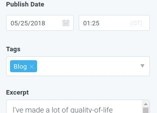
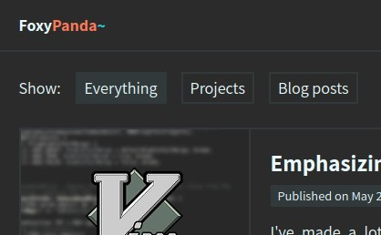

# Neon Panda

🐼 Ghost CMS theme for [foxypanda.me](https://foxypanda.me/).

**Features**:

- Uses a strict 5-component colour scheme:
    -  `#2b2b2b` Background
    -  `#31393b` Middleground
    -  `#e8fafd` Foreground
    -  `#25d7e5` Cyan
    -  `#ff7959` Orange
- Defines styles for the index view, post view and a page view.
- Supports filtering posts by tags.
- Supports lazy-loading for thumbnail images on the index page.
- Automatically adds anchor links to `<h1>` and `<h2>` tags in posts and pages.
- Supports responsive images, works well on mobile!
- Supports syntax highlighting via [Prism](https://prismjs.com/).
- Supports inline LaTeX via [MathJax](https://www.mathjax.org/).
- Adds social media buttons and [Disqus](https://disqus.com/) comments to all posts.

# Using this theme

Neon Panda is designed for Ghost v1+, but could theoretically work on older versions too. You can download this theme as
a ZIP archive using the appropriate button above and import it into your Ghost setup.

## Initial setup

By default, Neon Panda supports only two tags: **Blog** (`blog`) and **Projects** (`projects`). The images below show
how the tags should be setup.


| 1. Create the tags in your Ghost settings | 2. Add a tag to your post            | 3. Use filter buttons to show/hide posts |
|-------------------------------------------|--------------------------------------|------------------------------------------|
|   |  |        |

If you want to define custom tags, you'll have to edit `index.hbs`. The filter buttons are defined inside the
`div.post-list-controls` container. For example, if you'll create a new tag **Gallery** (`gallery`), you'll have to add
the following line:

```html
<a class="post-list-controls-button" href="#gallery" data-filter=".tag-gallery">Galleries</a>
```

Finally, to enable comments, you'll need to register your site on [Disqus](https://disqus.com/) and edit
`partials/comments.hbs` accordingly.

## Analytics

This templates doesn't support any analytics tools. If you want to use, say, Google Analytics, you can use the *Code
Injection* feature (check your Ghost Admin sidebar for the relevant section).

## Code and syntax highlighting

To add code snippets with syntax highlighting, you can use the standard Markdown syntax, adding language as follows:

```
\```javascript
// This code will be highlighted.
const hello = 'world';
\```
```

Of course, if you use Markdown inline code snippets (i.e. `\`monospace\``) no syntax highlighting will occur. To get
syntax higlighting for inline code you can use something like `<code class="language-javascript">const num = 3;</code>`.

## Inline LaTeX

You can add inline LaTeX snippets using `$ ... $` syntax, e.g. `$ \sum_{i=0}^n i^2 $`. To render the equation on a new
line, use the `$$ ... $$` environment.


# Extending this theme

First, you'll need to install [npm](https://www.npmjs.com/) (comes with Node) and [gulp](https://gulpjs.com/). The,
install all local dependencies using `npm install`.

This theme uses SCSS to generate CSS files. The CSS files also have to be minimised - all of this can be done using the
`gulp watch` command, which will watch all SCSS files for changes, compile `style.css`, and the minimise it into
`style.min.css`. To minify JavaScript after editing `assets/js/index.js`, use `gulp compress-js`.
